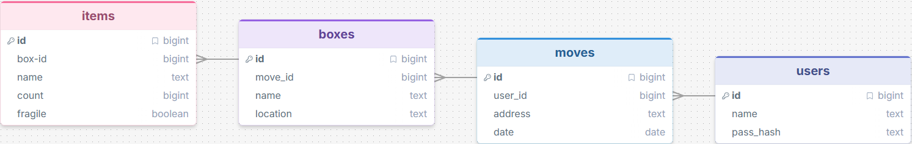

# Sprint 1 - Developing a DB and UI Prototype

## Sprint Goals

Develop a design for the database and a UI prototype that simulates the key functionality of the system. Test and refine the UI so that it can serve as the model for the next phase of development in Sprint 2.

### Specific Goals

**Edit these goals as needed**

- Design the database:
    - Tables
    - Fields / types
    - Primary keys
    - Default / nullable values
    - Relationships (foreign keys)
- Design the UI
    - Key pages
    - User interactions and 'flow'
    - Page layouts / features
    - Colour palette
    - Etc.

## Initial Database Design

To start with the database, I made a design in DrawSQL. This has 4 tables, items, boxes, moves and users. Items are individual things in boxes, boxes are boxes, moves is for each time you move all your stuff into a new house, and users is users.

### Required Data Input

Inputted data will be minor information regarding the item, the box, and also the move. The user will also have to input their email and phone number optionally to help with account recovery if they wish to use the app later in the future

### Required Data Output

The system will output most of the data the user inputs, such as the details for any item and box, and address of the new place.

### Required Data Processing

no

## UI 'Flow'

The first stage of prototyping was to explore how the UI might 'flow' between states, based on the required functionality.

This Figma demo shows the initial design for the UI 'flow':

[prototype V1](https://design.penpot.app/#/view?file-id=64054412-1123-81ed-8008-5d188a46b1e5&page-id=f0485fb1-4e63-8165-8008-3908f21f66a7&section=interactions&index=0&share-id=a1a9e568-e174-80fb-8008-5d1db1b186ff)

### Testing

I gave it to my end user who had a play around with it and decided that she liked it, however a feature that she would like integrated is a way to print a list of items inside a box, so it could be taped onto said box for better help finding an item

### Changes / Improvements

i added a print button to the box page that takes the user to a review page where they can see the list they'll be printing and then confirmation

[prototype V1.5](https://design.penpot.app/#/view?file-id=bd31e32d-d69f-81e2-8008-637b90d00220&page-id=f0485fb1-4e63-8165-8008-3908f21f66a7&section=interactions&index=0&share-id=2be68822-842f-8175-8008-661819fb7d0f)

## Initial UI Prototype

The next stage of prototyping was to develop the layout for each screen of the UI.

This Figma demo shows the initial layout design for the UI:

[prototype V2](https://design.penpot.app/#/view?file-id=f0485fb1-4e63-8165-8008-3908f21f66a6&page-id=f0485fb1-4e63-8165-8008-3908f21f66a7&section=interactions&frame-id=97849926-5d12-8018-8008-39090d3ea4c0&index=0&share-id=ddb7145f-a1be-80bb-8008-6c81874b3a7e)

### Testing

Replace this text with notes about what you did to test the UI flow and the outcome of the testing.

### Changes / Improvements

Replace this text with notes any improvements you made as a result of the testing.

*FIGMA IMPROVED PROTOTYPE - PLACE THE FIGMA EMBED CODE HERE - MAKE SURE IT IS SET SO THAT EVERYONE CAN ACCESS IT*

## Refined UI Prototype

Having established the layout of the UI screens, the prototype was refined visually, in terms of colour, fonts, etc.

i asked my end user for her favorite color and it was a mint green, so i made a realtime colors with that

[realtime colors](https://www.realtimecolors.com/?colors=adffda-0b2415-0d4d3b-072f24-00ffb2&fonts=Inter-Inter)

This Figma demo shows the UI with refinements applied:

[prototype V3](https://www.realtimecolors.com/?colors=adffda-0b2415-0d4d3b-072f24-00ffb2&fonts=Inter-Inter)

### Testing

Mr Copley said that the cancel and confirm buttons seemed really big and obtrusive, and suggested i changed the design to make them smaller, and more fitting to the color palette, as before they were a contrasting red and green compared to the minty teal i had before.

### Changes / Improvements

Replace this text with notes any improvements you made as a result of the testing.

*FIGMA IMPROVED REFINED PROTOTYPE - PLACE THE FIGMA EMBED CODE HERE - MAKE SURE IT IS SET SO THAT EVERYONE CAN ACCESS IT*

## Sprint Review

Replace this text with a statement about how the sprint has moved the project forward - key success point, any things that didn't go so well, etc.

