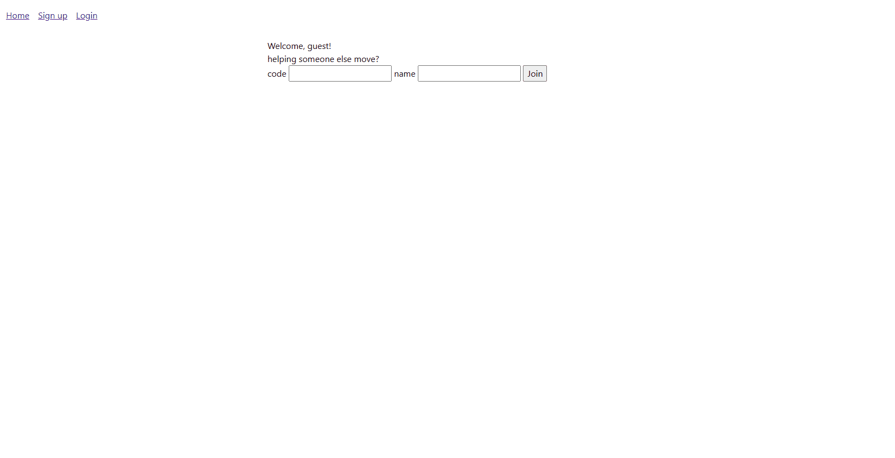
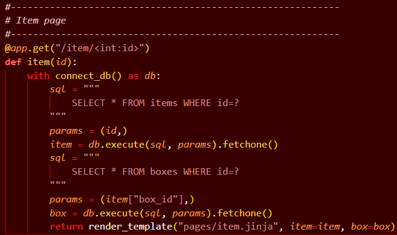

# Sprint 2 - Implement Database and Display of Test Data

## Sprint Goals

Implement the database, populated with test data. Create queries that retrieve test data, and display this on web pages as needed. Test and refine the queries and data display, so that it stands as the basis of the next sprint.

### Specific Goals

**Edit these goals as needed**

- Implement the database
- Add test data to the database
- Create the following web pages:
    - Home page showing the moves of a user, a form to add a new move, and an option to join someone else's move
    - Details page for move, box, item
- Develop SQL database queries to:
    - Retrieve all...
    - Retrieve specific ...
    - Etc.

## Testing Displayment of data

getting data to show up on the screen, tested by looking at the screen

**PLACE SCREENSHOTS AND/OR ANIMATED GIFS OF THE TESTING HERE**

### Changes / Improvements

Replace this text with notes any improvements you made as a result of the testing.

**PLACE SCREENSHOTS AND/OR ANIMATED GIFS OF THE IMPROVED SYSTEM HERE**

## Testing Sign up/Log in

signing up and logging in to the website so you can have your own private data

### Changes / Improvements

It was annoying to manually log in after signing up so I changed it so that it immediately logs in after creating an account

**PLACE SCREENSHOTS AND/OR ANIMATED GIFS OF THE IMPROVED SYSTEM HERE**

## Testing going backwards to the container

this is a link that takes you to the user of a move, the move of a box, or the box of an item.

### Changes / Improvements

Replace this text with notes any improvements you made as a result of the testing.

**PLACE SCREENSHOTS AND/OR ANIMATED GIFS OF THE IMPROVED SYSTEM HERE**

## ETC...

## Sprint Review

Replace this text with a statement about how the sprint has moved the project forward - key success point, any things that didn't go so well, etc.

